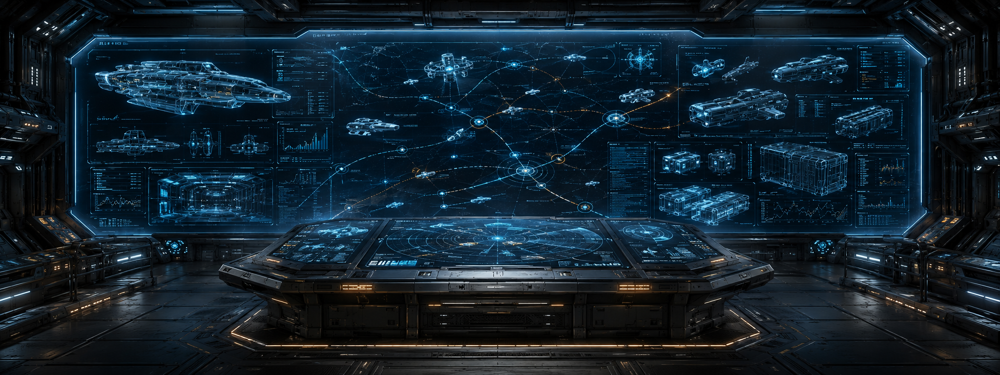
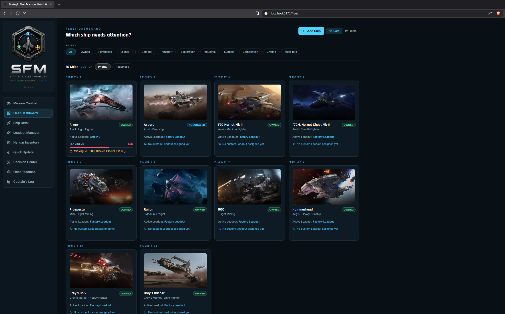
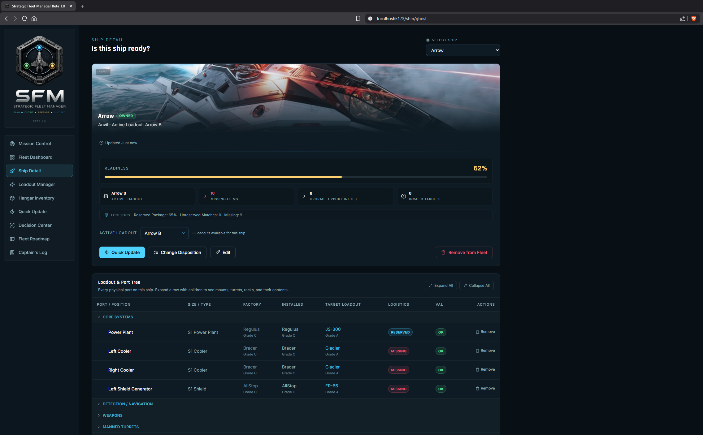
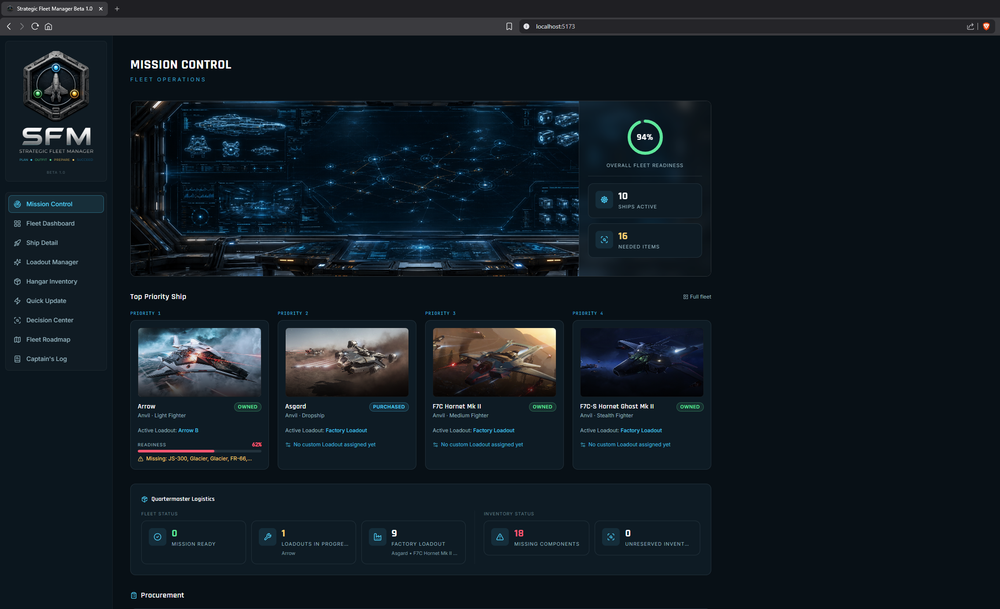

# Strategic Fleet Manager

**Status: Beta 1.2** — Certified for Star Citizen **LIVE 4.9.186.42610**.
Strategic Fleet Manager is Beta software. Core fleet-management workflows are
functional and certified against real Star Citizen data, but the project is
still under active development and has not yet reached a stable 1.0 release.

Strategic Fleet Manager (SFM) is a local-first companion app for Star
Citizen pilots who manage more than a couple of ships. It tracks your fleet,
their loadouts, and your component inventory, and tells you what's missing,
what's mismatched, and what to do next — instead of leaving you to maintain
a spreadsheet by hand.

<!-- README hero image placeholder — see docs/images/README.md for the
     expected asset. Rendered once a hero banner is commissioned. -->
<p align="center">
  
</p>

## Current Capabilities

- Fleet registry and prioritization
- Factory and custom loadout management
- Component inventory tracking
- Installed, target, and missing-component comparison
- Multiple ship roles and builds
- Fleet readiness reporting
- Quick Update workflow
- Golden Fleet data generated from Star Citizen LIVE data
- Commander-maintained ship imagery
- Local-first browser persistence

## Screenshots

<!-- Screenshot gallery placeholders — see docs/images/screenshots/README.md
     for the expected set. Populated once real captures are available. -->
| Fleet Dashboard | Ship Detail | Mission Control |
|---|---|---|
|  |  |  |

## Supported Star Citizen Version

Strategic Fleet Manager's Golden Fleet ship and component data is certified
against **Star Citizen LIVE 4.9.186.42610**. Data generated against other
patches or channels (PTU/EPTU) is not currently supported.

## Installation Requirements

- **Node.js 18 or later** (LTS recommended) and npm
- A modern desktop browser (Chrome, Firefox, or Edge)
- No Star Citizen installation or account is required to run the app —
  fleet and component data ship pre-generated with the repository

## Running the Beta

### First-time setup

1. Install [Node.js](https://nodejs.org/) 18 or newer.
2. Extract the SFM Beta ZIP.
3. Double-click **`Setup Strategic Fleet Manager.bat`**.
4. After setup completes, double-click **`Start Strategic Fleet Manager.bat`**.

### Daily use

- Double-click **`Start Strategic Fleet Manager.bat`**.
- Keep the terminal window open — closing it stops SFM.
- Open the displayed local URL (typically `http://localhost:5173`) if your
  browser doesn't open automatically.

### Developers / terminal use

```bash
git clone https://github.com/tmirzaian/Strategic-Fleet-Manager-SFM-.git
cd Strategic-Fleet-Manager-SFM-
npm install
npm run dev
```

Then open the printed local URL (typically `http://localhost:5173`).

To type-check and build a static production bundle instead:

```bash
npm run build
npm run preview
```

## Local Data & Privacy

Strategic Fleet Manager is local-first: your fleet, loadouts, and inventory
are stored entirely in your browser. Nothing is uploaded, no account is
required, and SFM does not currently contain analytics or telemetry. See
[PRIVACY.md](PRIVACY.md) for the full statement.

## Reporting Bugs & Requesting Features

Please use [GitHub Issues](../../issues) — a bug report template and a
feature request template are provided when you open a new issue. There is
no public Discord or support email yet; Issues are the primary support
channel during Beta.

## Known Limitations

- Browser-local persistence only — clearing browser data clears your fleet
- No cloud synchronization
- No RSI or CCUGame synchronization
- No Windows installer yet — Node.js is required to launch the Beta
- Some fleet-wide component-name ambiguities remain under investigation
- No telemetry or automatic update service
- Some ship images may use the SFM fallback artwork instead of real imagery

## Roadmap Summary

Near-term work focuses on Beta stabilization, GitHub presentation, and
launch experience polish. Longer-term, planned work includes a Windows
installer, RSI/CCUGame fleet synchronization, richer search, and a
dedicated support/about experience. See [docs/Roadmap.md](docs/Roadmap.md)
for the full, current roadmap.

## Credits

Strategic Fleet Manager is developed by **Quantum Thread Studio**. Ship and
component data is derived from Star Citizen's own game files using the
open-source [StarBreaker](https://github.com/StarBreakerSC/StarBreaker)
toolkit.

## Fan Project Disclaimer

Strategic Fleet Manager is an independent fan-created project and is not
affiliated with, endorsed by, or sponsored by Cloud Imperium Games or
Roberts Space Industries. Star Citizen, associated names, and related
assets are property of their respective owners.

## License

License selection is pending prior to public Beta release. All rights are
reserved until a license is published.
