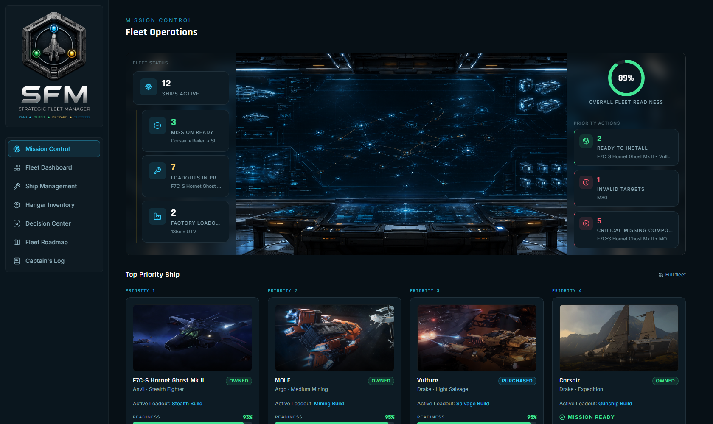
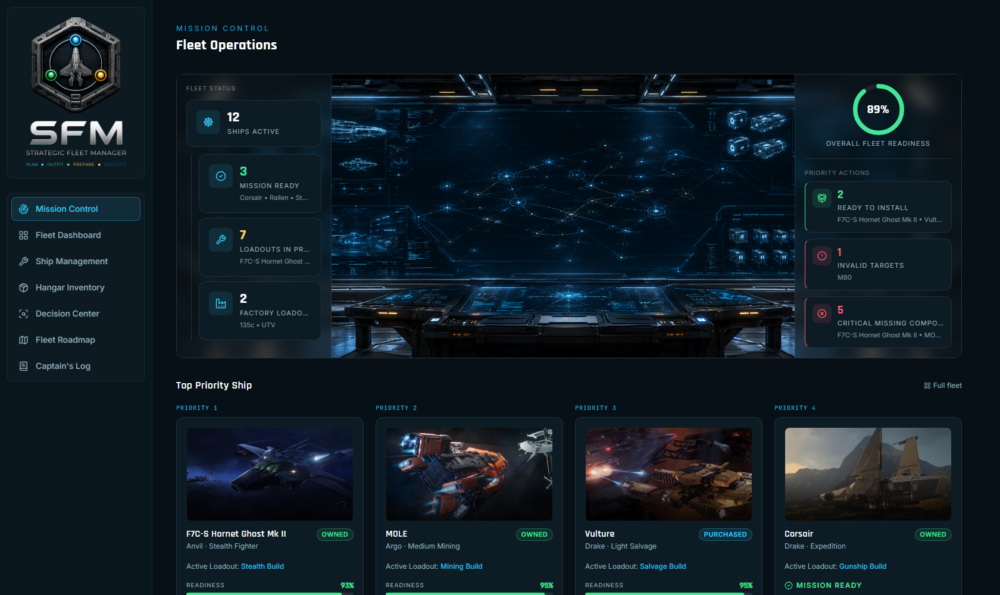
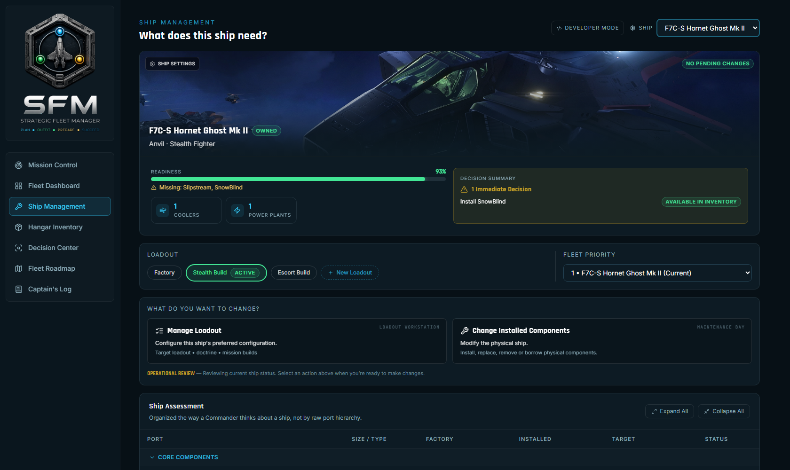
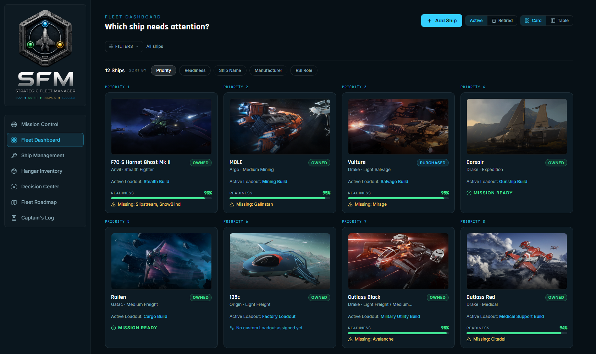
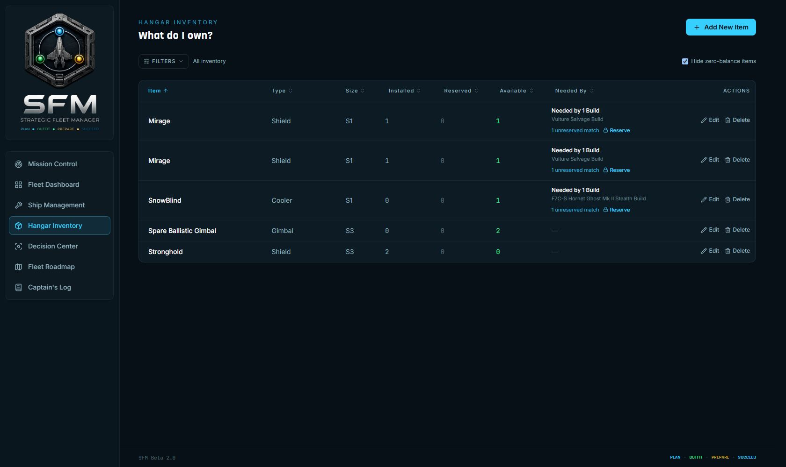
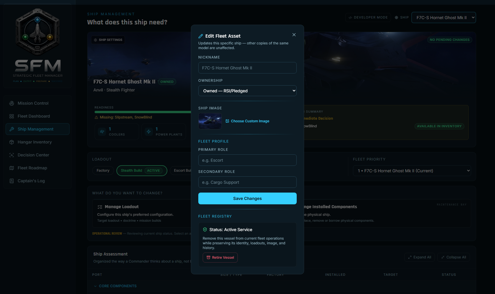
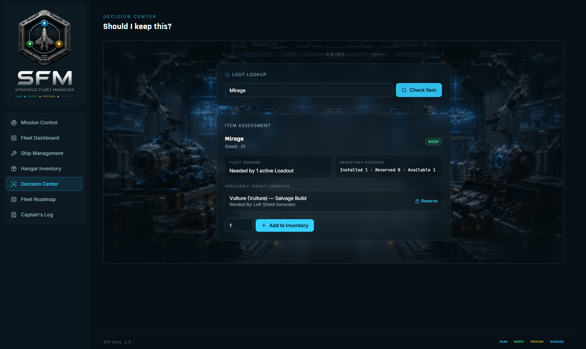
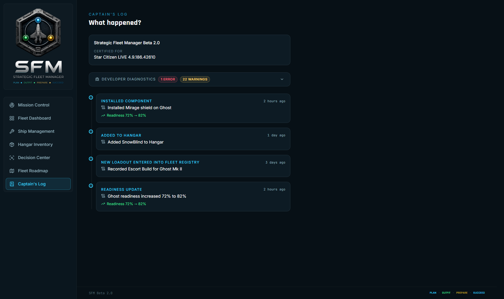
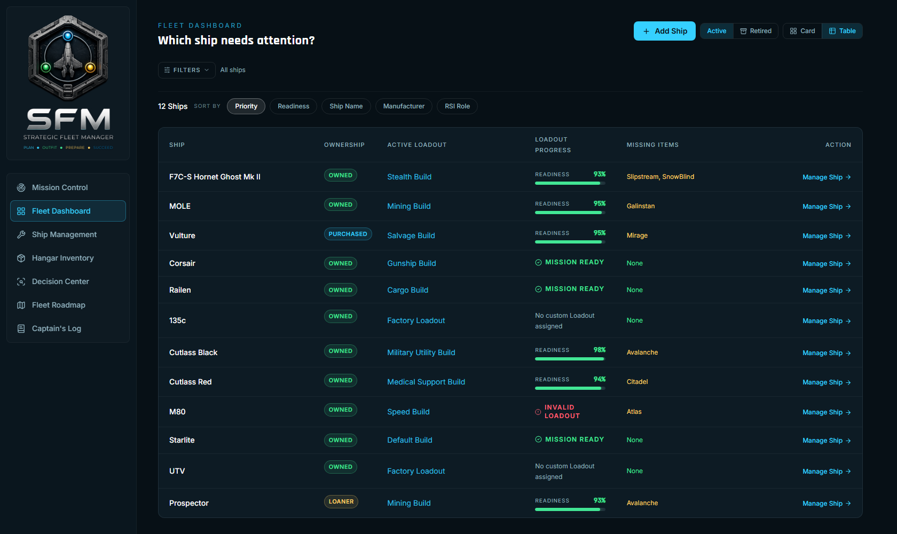

<p align="center">
  
</p>

# Strategic Fleet Manager

### Fleet Operations Platform for Star Citizen

**Current Release:** Beta 2.0

Strategic Fleet Manager (SFM) is a local-first Fleet Operations Platform built
for Star Citizen Commanders who manage growing fleets, complex ship loadouts,
and large component inventories.

Instead of relying on spreadsheets or manually comparing ship configurations,
SFM provides a unified Quartermaster workspace for fleet readiness, inventory
management, procurement planning, and operational decision support.

Strategic Fleet Manager transforms Star Citizen fleet management from
spreadsheets into a professional Quartermaster workflow.

## Why Strategic Fleet Manager?

| Capability | Purpose |
|---|---|
| 🚀 Fleet Registry | Persistent lifecycle management for every ship. |
| ⚙️ Quartermaster | Track inventory, reservations, shortages, and procurement. |
| 🎯 Decision Center | Receive actionable recommendations instead of raw inventory lists. |
| 📊 Mission Control | Monitor overall fleet readiness from a single operational dashboard. |

## Beta 2.0 Highlights

### Mission Control



Monitor fleet readiness, procurement priorities, and operational status from one command dashboard.

### Ship Management



Manage ships, loadouts, readiness, and Fleet Registry lifecycle from a unified workspace.

### Fleet Dashboard



Browse your entire fleet using rich visual cards with operational status at a glance.

### Hangar Inventory



Track every component across inventory, reservations, and installed ships.

## Additional Features

| Fleet Registry | Decision Center |
|---|---|
|  |  |

| Captain's Log | Fleet Dashboard (Table) |
|---|---|
|  |  |

## Current Capabilities

- Fleet Registry lifecycle management
- Mission Control
- Decision Center
- Hangar Inventory
- Ship Management
- Component reservations
- Procurement planning
- Captain's Log
- Commander-managed ship imagery
- Local-first persistence

## Roadmap

**Beta 2.1**
- Backup / Restore
- Fleet Registry Purge
- Import / Export

**Beta 2.2**
- Organization reservations
- Shared logistics

**Beta 2.3**
- RSI synchronization

**Beta 3.0**
- Quartermaster Edition

See [docs/Roadmap.md](docs/Roadmap.md) for the full detailed roadmap.

## Compatibility

Certified for **Star Citizen LIVE 4.9.186.42610**. Data generated against
other patches or channels (PTU/EPTU) is not currently supported.

## Documentation

- [Architecture](docs/Architecture.md)
- [Architecture Decision Records (ADRs)](docs/ADR/)
- [Roadmap](docs/Roadmap.md)
- [Testing](docs/Testing.md)
- [Release Notes](CHANGELOG.md)
- [Engineering Change Log](docs/UI_ARCHITECTURE.md) — the full feature-by-feature engineering record behind every Beta 2.0 change

## Installation Requirements

- **Node.js 18 or later** (LTS recommended) and npm
- A modern desktop browser (Chrome, Firefox, or Edge)
- No Star Citizen installation or account is required to run the app —
  fleet and component data ship pre-generated with the repository

## Running the Beta

### First-time setup

1. Install [Node.js](https://nodejs.org/) 18 or newer.
2. Extract the SFM Beta ZIP.
3. Double-click **`Setup Strategic Fleet Manager.bat`**.
4. After setup completes, double-click **`Start Strategic Fleet Manager.bat`**.

### Daily use

- Double-click **`Start Strategic Fleet Manager.bat`**.
- Keep the terminal window open — closing it stops SFM.
- Open the displayed local URL (typically `http://localhost:5173`) if your
  browser doesn't open automatically.

### Developers / terminal use

```bash
git clone https://github.com/tmirzaian/Strategic-Fleet-Manager-SFM-.git
cd Strategic-Fleet-Manager-SFM-
npm install
npm run dev
```

Then open the printed local URL (typically `http://localhost:5173`).

To type-check and build a static production bundle instead:

```bash
npm run build
npm run preview
```

## Local Data & Privacy

Strategic Fleet Manager is local-first: your fleet, loadouts, and inventory
are stored entirely in your browser. Nothing is uploaded, no account is
required, and SFM does not currently contain analytics or telemetry. See
[PRIVACY.md](PRIVACY.md) for the full statement.

## Reporting Bugs & Requesting Features

Please use [GitHub Issues](../../issues) — a bug report template and a
feature request template are provided when you open a new issue. There is
no public Discord or support email yet; Issues are the primary support
channel during Beta.

## Known Limitations

- Browser-local persistence only — clearing browser data clears your fleet
- No cloud synchronization
- No RSI or CCUGame synchronization
- No Windows installer yet — Node.js is required to launch the Beta
- Some fleet-wide component-name ambiguities remain under investigation
- No telemetry or automatic update service
- Some ship images may use the SFM fallback artwork instead of real imagery

## Credits

Strategic Fleet Manager is developed by **Quantum Thread Studio**. Ship and
component data is derived from Star Citizen's own game files using the
open-source [StarBreaker](https://github.com/StarBreakerSC/StarBreaker)
toolkit.

## Fan Project Disclaimer

Strategic Fleet Manager is an independent fan-created project and is not
affiliated with, endorsed by, or sponsored by Cloud Imperium Games or
Roberts Space Industries. Star Citizen, associated names, and related
assets are property of their respective owners.

## License

License selection is pending prior to public Beta release. All rights are
reserved until a license is published.
