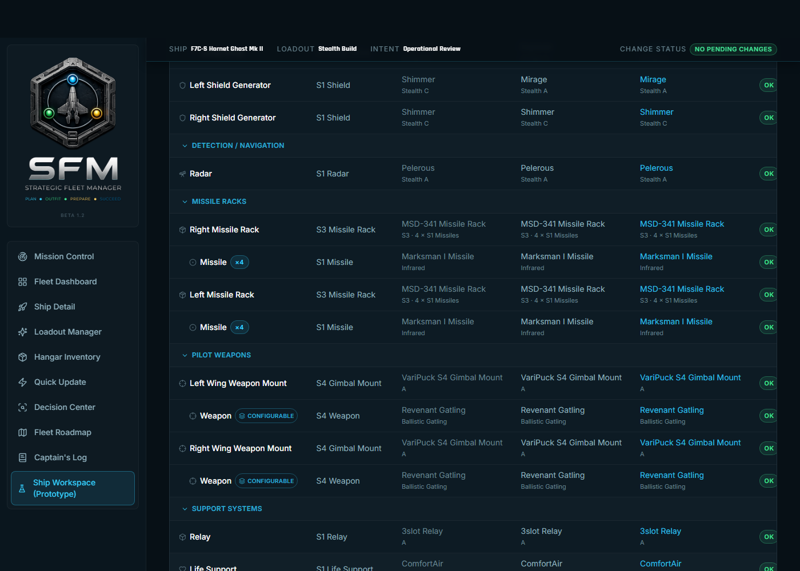
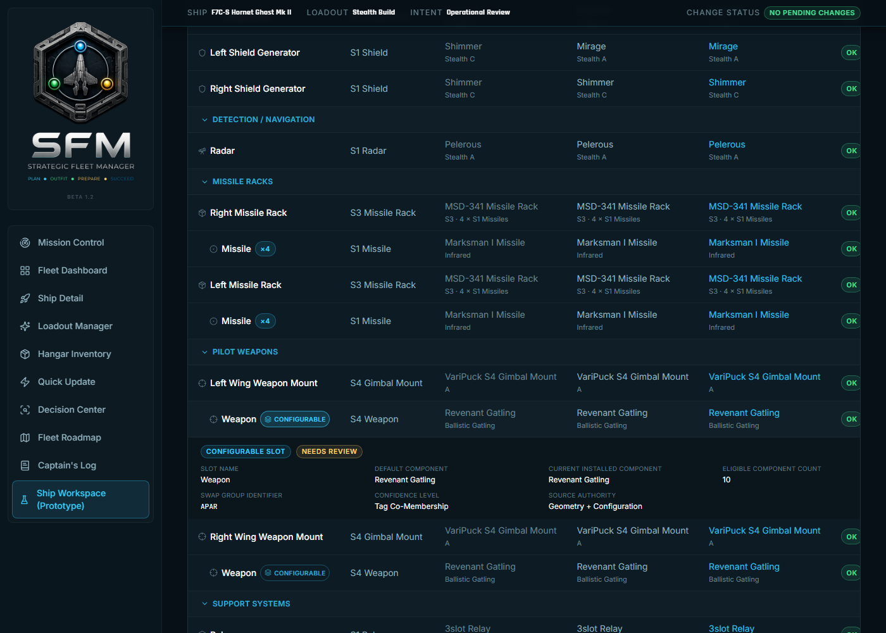
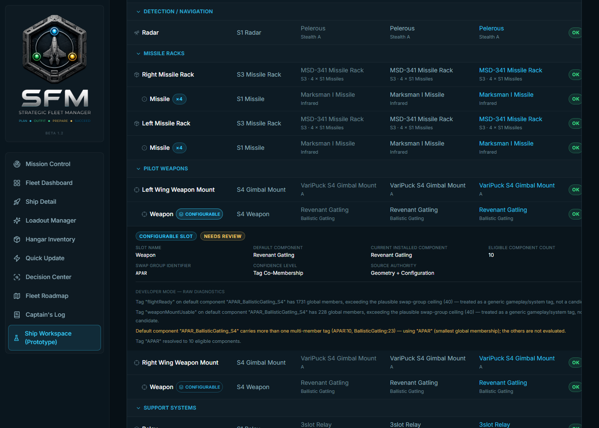

# SW-011A — Commander Configurable Slot Experience (Phase I): Demonstration Report

> **Status: complete.** Companion to `docs/SW-010B-Certification-Report.md` (the data this sprint exposes) and `docs/ADR/ADR-014-Configurable-Slot-Architecture.md` (the original architecture). This is the moment the configurable-slot pipeline, previously visible only inside engineering reports, became visible to a Commander.

## 1. Mission

Expose the SW-010B-certified configurable topology inside Ship Workspace: visibility, inspection, and understanding only — no editing, no module swapping, no persistence. Demonstrated live against the real, committed runtime catalog (`generated-data/configurable-slots.runtime.json`) and a real Fleet Asset (`ghost`, F7C-S Hornet Ghost Mk II, real entity class `ANVL_Hornet_F7CS_Mk2`).

## 2. What Was Built

The certified pipeline (`scripts/configurableSlots/`) is a build-time, StarBreaker-dependent tool — it cannot run in a Commander's browser. Making it Commander-visible required a new bridge, in four parts:

1. **A committed runtime catalog** (`generated-data/configurable-slots.runtime.json`, RC-008-style — the same small-committed-subset pattern as the component and ship catalogs). Derived by `npm run generate:configurable-slots-runtime-catalog` from a live fleet sweep shared with SW-010B's certification driver (`scripts/configurableSlots/fleetSweep.ts`, extracted this sprint so the ~25-minute, 257-ship sweep only runs once per invocation). Only Category A (confirmed), B (newly discovered), and C (review required) slots are included — Category D (rejected false positives) never reaches the browser. **245 of 257 ships, 3,926 Commander-visible slots.**

2. **A runtime identity bridge.** `Hardpoint` gained two new optional fields — `sourceItemPortName` and `sourceParentItemPortName` — mirroring the exact raw DataCore port names (`Port.internalName`) already flowing through the import pipeline, threaded through every construction site (`shipDefinitions.ts`, `fleetAssetMaterializer.ts`, `fleetAssetReconciliation.ts`, `useFleetStore.ts`) the same way `factoryEntityClass` was added by EWO-STAB-004A. A ship's real DataCore entity class is resolved via a new `resolveShipEntityClass()` (`src/utils/shipIdentityLine.ts`), reusing the same alias-resolution machinery `resolveShipStockRoleFocus` already established.

3. **Collision-safe matching.** A rendered port's bare name is not always unique per ship — confirmed live during this sprint's own testing: `ghost`'s Left and Right Wing Weapon Mounts both have a child named `hardpoint_class_2`. Matching on bare name alone would have hit this collision constantly. The lookup key is `(immediate parent's bare name, own bare name)` on both sides — resolved every real collision found without needing the full ancestor path. A genuine deeper collision (same bare name under an *also*-repeated parent — not observed on any ship checked this sprint) still degrades safely to "no confident match," never a guess.

4. **Ship Workspace integration** (`src/pages/ShipWorkspacePrototype.tsx`): a small cyan "Configurable" badge next to a matched port's label; click to open a read-only inline disclosure row (never a dialog — matches this page's own established idiom) showing all 7 required fields; a local, unpersisted Developer Mode toggle gating raw diagnostic detail behind a "Needs Review" indicator for Category C slots.

## 3. Live Demonstration (real data, real browser, no mocks)

Driven with Playwright against `npm run dev` (`VITE_SFM_DEV_SEED_FLEET=true`), navigating to `/ship-workspace/ghost`.

### 3.1 Configurable badges appear naturally within the existing tree (Objectives 1–2)

Two real, live-certified configurable slots — the Left and Right Wing Weapon Mounts' gimbal children — each show a small, distinct "CONFIGURABLE" pill inline with the existing port row. No new screen, no duplicate hierarchy, no change to any other row's rendering (the Missile Racks, Shield Generators, and Radar rows above are pixel-identical to before this sprint).

### 3.2 Read-only inspection shows all 7 required fields (Objective 3)

Clicking the badge opens an inline, read-only panel: **Slot Name** (Weapon), **Default Component** (Revenant Gatling), **Current Installed Component** (Revenant Gatling — read live from the Hardpoint row, not a stale catalog snapshot), **Eligible Component Count** (10), **Swap Group Identifier** (APAR), **Confidence Level** (Tag Co-Membership), **Source Authority** (Geometry + Configuration). A "NEEDS REVIEW" indicator appears because this specific slot is Category C in the real certification data — informational only, per Objective 4. No editing control of any kind is present (verified both visually and by an automated test asserting zero buttons/inputs/selects inside the panel).

### 3.3 Developer Mode reveals raw diagnostics on demand (Objective 4)

With Developer Mode enabled, the same panel additionally shows the exact diagnostic trail SW-010B's resolver produced for this slot — including the two `swap-group-membership-implausible` rejections (`flightReady`, `weaponMountUsable`) and the tie-break explanation that led to `APAR`. With Developer Mode off (the default an ordinary Commander sees), none of this technical detail is shown — only the plain-language "Needs Review" badge.

### 3.4 Non-configurable ships are unaffected (Objective 5)

`GRIN_UTV` (the 'utv' seed Fleet Asset) has zero Commander-visible configurable slots in the real catalog. Loaded, expanded fully: zero Configurable badges rendered, zero console errors, ship name and all port data present exactly as before this sprint.

### 3.5 Performance (Objective 6)

| Ship | Configurable slots on this hull | Cold navigation to interactive |
|---|---|---|
| `ghost` (configurable) | 2 rendered matches (of 24 catalog entries — see §4) | 2,404 ms |
| `utv` (non-configurable) | 0 | 2,506 ms |

No measurable difference — the lookup is a small, per-ship, memoized `Map` build (`useMemo` keyed on entity class), not a fleet-wide scan. Zero console errors in either case.

## 4. Known, Honestly-Reported Limitation: Aggregated Rows

`ghost`'s catalog entry includes 8 real, certified missile-attach slots (`missile_01_attach` through `missile_04_attach`, both racks) — none show a badge. Root cause: Ship Workspace already collapses a missile rack's 4 individual slots into one "Missile ×4" aggregate row (`withMissileRackAggregation`, pre-existing, unrelated to this sprint). The aggregate row's identity doesn't correspond to any single catalog entry, so the match correctly finds nothing rather than guessing which of the 4 underlying slots to represent. This is the safe failure direction (under-reporting, never a wrong or misleading badge) and required no design compromise elsewhere — but it means aggregated port types (currently: missile racks) are invisible to this Phase I feature even when genuinely configurable. Recorded here for SW-011B's own scoping, not fixed in this sprint (aggregate-row support was never in SW-011A's objectives).

A second, larger-scale limitation, inherited from the architecture itself rather than this sprint's own scope: most of SW-010A's original flagship showcase slots (e.g. the Hornet's own `hardpoint_weapon_center`) are `configuration-only` in the canonical model — the app's real geometry-derived port tree never materializes a row for them at all (confirmed live this sprint). Phase I only attaches to *existing* rows (Objective 1's own "no duplicate hierarchy" constraint), so these remain invisible to the Commander until a future phase decides whether synthesizing new tree nodes for `configuration-only` slots is in scope. Not a regression — SW-010A's own Runtime Model always described this as `sourceAuthority: 'configuration-only'` precisely to make this distinction visible to engineering.

## 5. Verification Summary

- ✅ Configurable assemblies render in Ship Workspace — demonstrated live, real data (§3.1).
- ✅ Existing hierarchy remains intact — every non-matched row pixel-identical to before.
- ✅ Configurable nodes are visually identifiable — small, distinct cyan pill, consistent with existing Badge language.
- ✅ Inspection panel displays canonical metadata — all 7 required fields, real values (§3.2).
- ✅ No editing is possible — verified visually and by automated test (zero interactive controls in the panel).
- ✅ Ordinary ships remain unaffected — GRIN_UTV, zero badges, zero regressions (§3.4).
- ✅ Performance remains acceptable — no measurable difference (§3.5).
- ✅ Full regression suite passes — 159 test files, 1,911 tests (up from 1,878 pre-sprint).
- ✅ `tsc --noEmit` clean throughout.

## 6. Recommendation

The architecture is now visible, not just proven. SW-011B (Commander Configurable Slot Management) can build controlled editing on top of a bridge already demonstrated end-to-end against real, live-certified data — with two known, narrow, honestly-documented gaps (aggregated rows, `configuration-only` slots) rather than any hidden ones.
